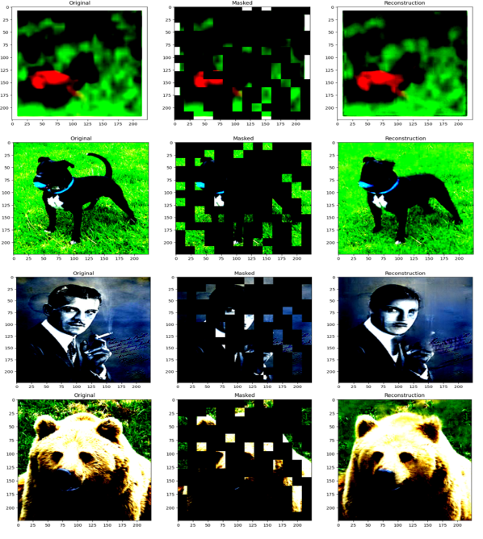
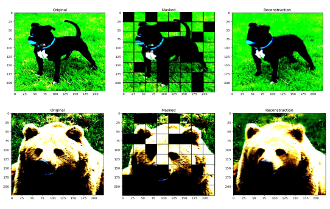
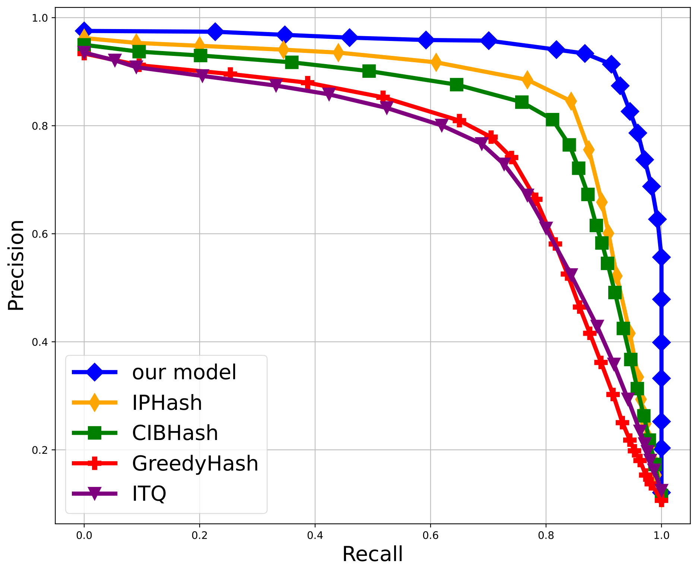

# CMAEH ICPR 2024
CMAEH: Contrastive masked autoencoder based hashing for efficient image retrieval
International Conference on Pattern Recognition (ICPR) 2024

## Architecture

Fig. 1: The framework for image retrieval is named Contrastive Masked Au-
toencoder hashing (CMAEH ). The pre-trained MAE_VIT is utilized for image
classification in this framework, as denoted by the Red Dotted Line. The model
is then trained for the primary retrieval task, as shown by the Blue Dotted Line.
We optimize the model by using a combined strategy that includes the Hashing
Loss, Supervised Contrastive Loss, and Reconstruction Loss.

This code uses the Masked AutoEncoder Vision Transformer (ViT) code and pretrained model ([https://github.com/jeonsworld/ViT-pytorch] [(https://github.com/facebookresearch/mae)] and DeepHash framework (https://github.com/swuxyj/DeepHash-pytorch).

Download the MAE-ViT pretrained models from official repository and keep under pretrainedVIT directory:
[https://github.com/facebookresearch/mae]

Download data from https://github.com/swuxyj/DeepHash-pytorch for different dataset, if not already present under data directory.

## Regenrated Sample Image

## Qualitative results

![Retrieval reseult of CIFAR10(fig/cifar10(0.25).png)]

